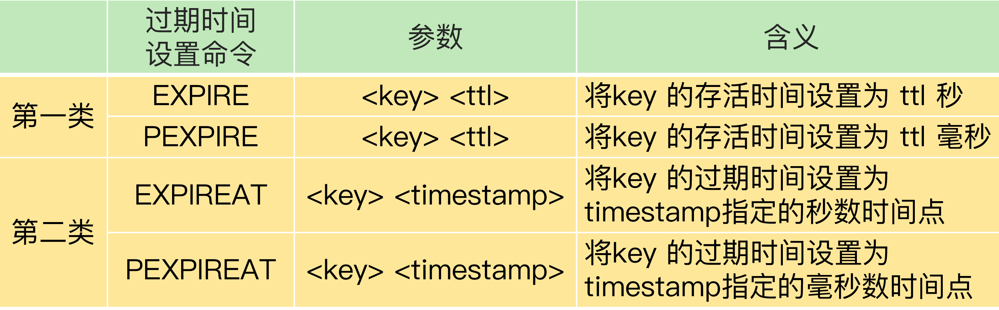

# redis 文档

## 生产环境部署

### 本地主从复制模式搭建

1. 创建redis7000 redis7001 redis7002三个文件夹

2. 复制redis.conf文件到文件夹下并修改配置文件

3. 进去redis7000文件夹，修改redis.conf文件
   1. 修改绑定ip
   2. 修改端口号（生产环境无需修改）
   3. 启动后台运行 daemonize yes
   4. 修改启动pid（生产环境无需修改）
   5. 注意持久化文件存放目录 dir
   6. 启动三个redis   redis-server redis.conf

4. 主从复制已经搭建完成，master有读写权限，slave负责读数据和容灾。

   

**读写分离的特性**

master具有读写权限，slaver是只读的，当master的数据更新时，slaver会同步master中更新的数据

优点：

* 读写分离，减轻master的压力
* 容灾

### 生产环境主从复制模式搭建

~~~ shell
tar -zxvf redis-stable.tar.gz
~~~

redis.conf文件需商讨后再做配置

## 场景案例

### 简单场景

* 如果你只需要存储简单的键值对，或者是对数字进行递增递减操作，就可以使用 String 存储

* 如果需要一个简单的分布式队列服务，可以使用List 

* 如果除了需要存储键值数据，相对与String类型的将实体直接序列化为value，如果想单独对某个字段进行操作，可以使用 Hash 

* 在需要去重的场景中，就可以使用 Set，而且在聚合统计的场景中它还可以做并集、差集和交集运算

* 实现一个带权重的字段、排序统计的场景，可以使用Sorted Set

* 如果一个字段只有是非两个状态可以使用二值统计（SETBIT），可以大大节省空间

* 大量的数据做COUNT处理，可以使用HyperLogLog类型（PFADD），只需要12 KB 内存，就可以计算接近 2^64 个元素的基数。需要注意的是，这个统计算法并不保证精确计算。

  

### 复杂场景

#### 按需选择数据结构

在简单的key value场景中，如果数据量较大，可以考虑使用集合类型做二级编码存储，用以节省容量。

* 内存占用对比

  ~~~shell
  > info memory
  # Memory
  used_memory:2202224
  > set 2222222222 1111111111
  OK
  > info memory
  # Memory
  used_memory:2202288
  # 使用String存储一个10长度的long类型数据占用了64B的空间
  
  > info memory
  # Memory
  used_memory:858208
  # 使用hash做二级编码存储
  > hset 1101000 060 3302000081
  1
  > info memory
  # Memory
  used_memory:858336
  # 第一次使用hash存储，元数据加上数据总共占用128B空间
  > hset 1101000 061 3302000081
  1
  > info memory
  # Memory
  used_memory:858352
  # 第二次存储，占用16B空间
  ~~~

* 由于String类型是由redis自身维护的SDS结构体，在记录数据时，元数据的内存开销比较大，不太适合保存大量数据，但同时这也提升了查询的效率。而集合类型都会采用压缩列表(ziplist)的底层数据结构进行存储，这种存储方式降低了内存的占用，但是同时它的查询效率没有String类型高，另外需要注意的时，在使用集合类型时，如果元素个数或长度超过阈值的时候，会把底层数据结构转为hash表，此时就没有那么高的内存优势了。

  这两个阈值分别对应以下两个配置项：

  hash-max-ziplist-entries：表示用压缩列表保存时哈希集合中的最大元素个数。

  hash-max-ziplist-value：表示用压缩列表保存时哈希集合中单个元素的最大长度。

* 可以根据实际场景，自行选择方案。

#### session共享

  在分布式环境中，由于上游nginx的负载均衡策略，在非ip-hash的策略下，一次请求响应的过程可能不在同一台机器上执行，因此可能会造成session丢失的情况，使用redis可以将session统一管理。

  * 环境搭建

    使用spring-session-data-redis可以实现无感升级，原有的<u>request.getSession("key")</u>的代码无需更改。

    ```xml
    <!--spring-session-redis 用作session集群间共享-->
    <dependency>
        <groupId>org.springframework.boot</groupId>
        <artifactId>spring-boot-starter-data-redis</artifactId>
    </dependency>
    <dependency>
        <groupId>org.springframework.session</groupId>
        <artifactId>spring-session-data-redis</artifactId>
    </dependency>
    ```
    
    * 负责均衡策略为轮询模式，日志如下
    
    ~~~shell
    127.0.0.1 - - [26/May/2021:15:19:05 +0800] "POST /bocEPay/business/set HTTP/1.1" 200 71 "-" "PostmanRuntime/7.28.0" "-"1 127.0.0.1:9999 upstream_response_time 0.188 request_time 0.187
    127.0.0.1 - - [26/May/2021:15:19:08 +0800] "POST /bocEPay/business/get HTTP/1.1" 200 55 "-" "PostmanRuntime/7.28.0" "-"1 127.0.0.1:9998 upstream_response_time 0.160 request_time 0.160
    127.0.0.1 - - [26/May/2021:15:19:09 +0800] "POST /bocEPay/business/get HTTP/1.1" 200 55 "-" "PostmanRuntime/7.28.0" "-"1 127.0.0.1:9999 upstream_response_time 0.017 request_time 0.017
    127.0.0.1 - - [26/May/2021:15:19:16 +0800] "POST /bocEPay/business/get HTTP/1.1" 200 55 "-" "PostmanRuntime/7.28.0" "-"1 127.0.0.1:9998 upstream_response_time 0.013 request_time 0.014
    127.0.0.1 - - [26/May/2021:15:19:16 +0800] "POST /bocEPay/business/get HTTP/1.1" 200 55 "-" "PostmanRuntime/7.28.0" "-"1 127.0.0.1:9999 upstream_response_time 0.011 request_time 0.012
    127.0.0.1 - - [26/May/2021:15:19:17 +0800] "POST /bocEPay/business/get HTTP/1.1" 200 55 "-" "PostmanRuntime/7.28.0" "-"1 127.0.0.1:9998 upstream_response_time 0.014 request_time 0.015
    127.0.0.1 - - [26/May/2021:15:19:17 +0800] "POST /bocEPay/business/get HTTP/1.1" 200 55 "-" "PostmanRuntime/7.28.0" "-"1 127.0.0.1:9999 upstream_response_time 0.014 request_time 0.015
    ~~~
    
    *  postman测试响应结果
    
    ~~~json
    {
        "message": "成功",
        "code": 200,
        "data": "value"
    }
    ~~~

####  分布式锁

在单体架构中，为防止线程间对一个句柄的相互竞争，可以加锁处理，但在分布式架构中，线程级别的锁不足以应对业务需求，这时就需要一把进程级别的锁。

  * 单节点的分布式锁

    一个单节点的分布式锁应该满足加锁时的原子性，还应该保证这把锁一定能够被释放，不然就会成为死锁

    ~~~xml
    <dependency>
      <groupId>org.redisson</groupId>
      <artifactId>redisson-spring-boot-starter</artifactId>
      <version>3.15.5</version>
    </dependency>
    ~~~

  * 基于多个 Redis 节点实现高可靠的分布式锁

#### 缓存

* 缓存穿透
  * 直接缓存(id,null)
  * 布隆过滤器

#### 消息队列

#### bloom filter

## 踩坑

### 全量复制时cpu占用过高

[全量复制问题](https://time.geekbang.org/column/article/272852)

### 内存占满如何处理

需要根据实际业务，选好maxmemory-policy(最大内存淘汰策略)

1. 禁止存放新数据 noeviction
2. 回收策略
   * volatile-lru：当内存不足以容纳新写入数据时，从设置了过期时间的key中使用LRU（最近最少使用）算法进行淘汰
   * allkeys-lru：当内存不足以容纳新写入数据时，从所有key中使用LRU（最近最少使用）算法进行淘汰
   * volatile-lfu：4.0版本新增，当内存不足以容纳新写入数据时，在过期的key中，使用LFU算法进行删除key
   * allkeys-lfu：4.0版本新增，当内存不足以容纳新写入数据时，从所有key中使用LFU算法进行淘汰
   * volatile-random：当内存不足以容纳新写入数据时，从设置了过期时间的key中，随机淘汰数据
   * allkeys-random：当内存不足以容纳新写入数据时，从所有key中随机淘汰数据
   * volatile-ttl：当内存不足以容纳新写入数据时，在设置了过期时间的key中，根据过期时间进行淘汰，越早过期的优先被淘汰

### 宕机恢复处理

主从复制时，从机在主机重启但未加载数据时复制了空数据

1. 在主从复制的场景下，要关闭主机的自动重启功能，因为主机在自动重启后，数据还在本地恢复中，此时从机发现主机上线，会尝试与主机进行同步，造成集群数据丢失
2. 正确的操作应该是手动将从服务器升级为主服务器（slaveof no one），然后开启原主机，设置从属于新的主服务器(slaveof  [ip])


### 数据不一致

#### 读写分离模式下数据不一致问题

由于主从复制时，主从数据会有微小的差异，有可能造成客户端读取从库的数据与主库不一致，有以下几种处理方式。

* 如果业务允许容忍一定的数据不一致问题，可以不做处理。

* 强制从主库读取数据，从库只做容灾。

* 在业务上做数据校验

* 开发监控程序，在主从差异过大时，停止该从库的读取操作。

#### 删除策略引发的脏读问题

redis的删除操作并不会真正把数据删除，而是标记后再做删除处理。为了防止删除操作阻塞业务进行，redis设置了两种删除策略，分别是惰性删除策略和定期删除策略。

惰性删除只有当redis请求这条数据时发现这条数据已经被标记为删除了，才进行删除操作，但在redis3.2以下的版本中，如果是由从库访问该条数据，那么并不会被删除，而是返回了过期的数据。

定期删除策略是指，Redis 每隔一段时间（默认 100ms），就会随机选出一定数量的数据，检查它们是否过期，并把其中过期的数据删除，这样就可以及时释放一些内存。虽然定期删除策略可以释放一些内存，但是，Redis 为了避免过多删除操作对性能产生影响，每次随机检查数据的数量并不多。如果过期数据很多，并且一直没有再被访问的话，这些数据就会留存在 Redis 实例中。


设置数据过期时间的命令一共有 4 个



如果使用第一类命令，当主从库全量同步时，如果主库接收到了一条 EXPIRE 命令，那么，主库会直接执行这条命令。这条命令会在全量同步完成后，发给从库执行。而从库在执行时，就会在当前时间的基础上加上数据的存活时间，这样一来，从库上数据的过期时间就会比主库上延后了。因此，**尽量使用第二类过期命令**。

### 持久化策略

####  AOF日志

* AOF 里记录的是 Redis 收到的每一条命令，这些命令是以文本形式保存的

* AOF 是写后日志，Redis 是先执行命令，把数据写入内存，然后才记录日志

  * 执行成功再写日志，避免了写前日志的语法检查
  * 命令执行后才记录日志，所以不会阻塞当前的写操作

* 写后日志会造成日志丢失问题，同时尽管不会阻塞当前命令，但是会对下一个要执行的命令造成影响，因此需要配置合适的写回策略

  * Always，同步写回：每个写命令执行完，立马同步地将日志写回磁盘；

  * Everysec，每秒写回：每个写命令执行完，只是先把日志写到 AOF 文件的内存缓冲区，每隔一秒把缓冲区中的内容写入磁盘；

  * No，操作系统控制的写回：每个写命令执行完，只是先把日志写到 AOF 文件的内存缓冲区，由操作系统决定何时将缓冲区内容写回磁盘。

    

* 另外，由于某一时刻一个key的状态是过去CRUD操作的累加状态，所以可以对AOF日志进行压缩处理，这个过程称作AOF日志重写。

#### RDB内存快照

* bgsave模式，由后台开启子线程，写时复制。
* save模式，主线程进行，会阻塞主业务。

#### 混合模式

Redis 4.0 中提出了一个混合使用 AOF 日志和内存快照的方法。

内存快照以一定的频率执行，在两次快照之间，使用 AOF 日志记录这期间的所有命令操作。这样一来，快照不用很频繁地执行，这就避免了频繁 fork 对主线程的影响。而且，AOF 日志也只用记录两次快照间的操作，也就是说，不需要记录所有操作了，因此，就不会出现文件过大的情况了，也可以避免重写开销。

#### 如何选择持久化策略

* 数据不能丢失时，可以使用混合模式
* 如果允许分钟级别的数据丢失，可以只使用 RDB
* 如果只用 AOF，应该优先使用 everysec 的配置选项

### 脑裂问题

### 事务失效问题

#### redis官方文档解释

* Redis命令只有在使用错误语法调用时才会失败(并且在命令队列中无法检测到这个问题)，或者是针对持有错误数据类型的键:这意味着在实践中，一个失败的命令是编程错误的结果，而且是一种很可能在开发期间而不是在生产中检测到的错误。

* 通常情况下，回滚并不能让你避免编程错误。例如，如果查询将一个键增加2而不是1，或者增加了错误的键，那么回滚机制无法提供帮助。考虑到没有人能够挽救程序员的错误，并且Redis命令失败所需要的那种错误不太可能进入生产环境，我们选择了不支持错误回滚的更简单更快的方法。

#### 对ACID逐一分析

  * 原子性
      * redis支持声明式原子操作

        * MULTI 命令：表示一系列原子性操作的开始。收到这个命令后，Redis 就知道，接下来再收到的命令需要放到一个内部队列中，后续一起执行，保证原子性。
        * EXEC 命令：表示一系列原子性操作的结束。一旦 Redis 收到了这个命令，就表示所有要保证原子性的命令操作都已经发送完成了。此时，Redis 开始执行刚才放到内部队列中的所有命令操作。
        
        在
  * 一致性
  * 隔离性
  * 持久性

## Tips

* 要考虑到redis单线程的模型，尽量把业务放在redis客户端或者从库进行处理，防止redis阻塞。例如set集合的聚合操作，可以放在redis的客户端执行。

* Redis有一些绝对不应在生产环境中使用的命令，建议直接在配置文件中用redis的rename屏蔽掉这些高危命令

  * keys * 显示所有的key值

  * FLUSHALL 删除所有数据
    
  * FLUSHDB 删除数据库下的所有数据

    

    对于 KEYS 命令来说，可以用 SCAN 命令代替 KEYS 命令，分批返回符合条件的键值对，避免造成主线程阻塞。

    对于 FLUSHALL、FLUSHDB 命令来说，可以加上 ASYNC 选项，让这两个命令使用后台线程异步删除数据，可以避免阻塞主线程。

* 设计Redis的key的时候，要注意以下这几个点：

   * 以业务名为key前缀，用冒号隔开，以防止key冲突覆盖。如，live:rank:1
   * 确保key的语义清晰的情况下，key的长度尽量小于30个字符。
   * key禁止包含特殊字符，如空格、换行、单双引号以及其他转义字符。
   * Redis的key尽量设置过期时间，以保证不使用的Key能被及时清理或淘汰。
   
 * 慎用如SORT、SINTER、SINTERSTORE、ZUNIONSTORE、ZINTERSTORE等聚合命令，一般把它放到客户端来执行。

 * 避免使用 bigkey，Redis 是使用单线程读写数据，bigkey 的读写操作会阻塞线程，降低 Redis 的处理效率

 * 配置文件需要注意的属性：

    * 集合类型从压缩列表转为HASH表的阈值
       * hash-max-ziplist-entries：表示用压缩列表保存时哈希集合中的最大元素个数。
       * hash-max-ziplist-value：表示用压缩列表保存时哈希集合中单个元素的最大长度。
       
    * AOF配置

       * appendfsync 写回时机

       * 日志重写策略

          auto-aof-rewrite-percentage 100

          auto-aof-rewrite-min-size 64mb

    * RDB配置 

       * 例如save 60 10000 ，表示60秒（1分钟）内至少10000个key值改变（则进行数据库保存--持久化）
       * stop-writes-on-bgsave-error yes，后台保持失败时，是否允许redis正常运行。

    * 混合持久化模式配置

       * aof-use-rdb-preamble yes 配置yes即开启混合持久化
    
* set key value 与setbit key offset value 设置同一个key不会报错，因为String类型存储的就是二进制编码，同时setbit会改变原有数据的值。因此一定要规范命名，避免覆盖key的问题。

## 学习资料

[redis容量预估网站]( http://www.redis.cn/redis_memory/)

[中文配置文件](redis文档 v2.assets/redis-cn.conf)

[中文配置文件 web](https://blog.csdn.net/u010440155/article/details/53079942)

[命令文档](https://redis.io/commands/)

[命令文档-cn](http://redisdoc.com/)

[《Redis 使用手册》]()

[《Redis 设计与实现》](redis文档 v2.assets/redis设计与实现（第二版）.pdf)

[《Redis 开发与运维》](redis文档 v2.assets/Redis开发与运维.pdf)